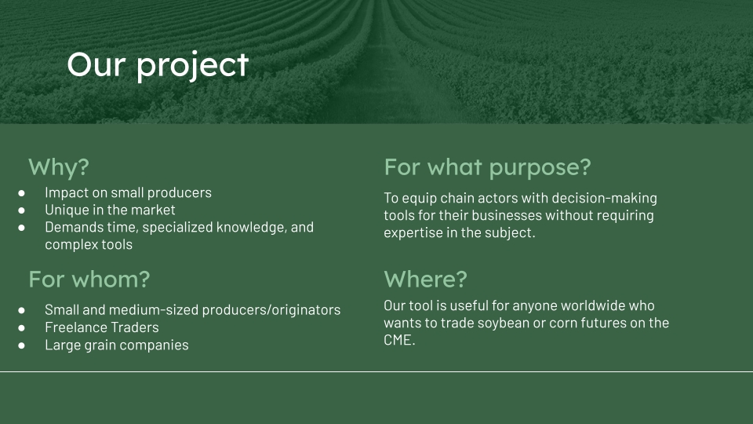
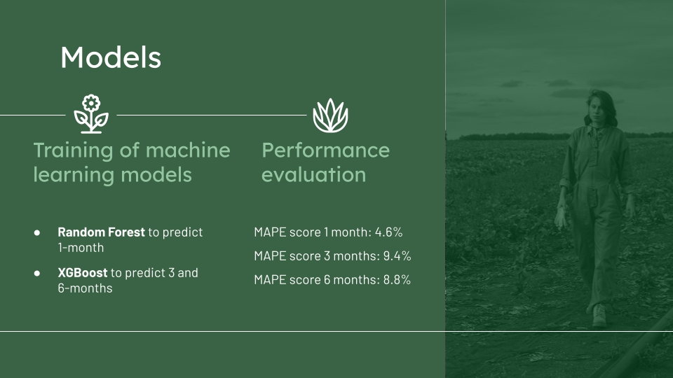

### Agrlcast Project ###

The following project was born with the intention of offering a tool or platform for users who need to know the trend that soybean and corn commodities will have in the coming months. They can access these values and make data-driven decisions, adding value to their business or activity.

The goal is to predict the prices of agricultural products using machine learning tools and data analysis, obtaining highly useful forecasts for farmers, traders, and market participants. The 3 target prediction horizons are 1, 3, and 6 months.

(image.png)

### Data Collection ###

Our sources for collecting data were:

TraidingView Platform
USDA: United States Department of Agriculture.

### Data Cleaning and Data Preparation ###

After the tasks of data collection and cleaning, we performed a comprehensive analysis of the different variables and selected the important ones that significantly influence and have a strong correlation with each other. The selected variables include:

Historical prices of commodities
Moving averages of historical prices
SP 500
USA Production
Real interest rate USA

### Model Training ###

Based on the preceding steps and in line with the proposed objectives (horizons and type of prediction), we carried out tests and training of different predictive models, seeking those that achieve the best performance and metrics, while considering techniques to prevent overfitting and data leakage.

### Performance Evaluation and Metrics ###

We conducted performance evaluations and calculated various metrics to validate the accuracy of the selected models.

### Deployment and User Interface ###

For our project, we used Streamlit, a Python library that allows us to deploy and put our model into use in a very simple way.

### We invite you to visualize and enjoy ###

Streamlit: https://agriculturalmarketpredictions-project.streamlit.app/About_the_project
Github : https://agriculturalmarketpredictions-project.streamlit.app/

### Our Team ###

